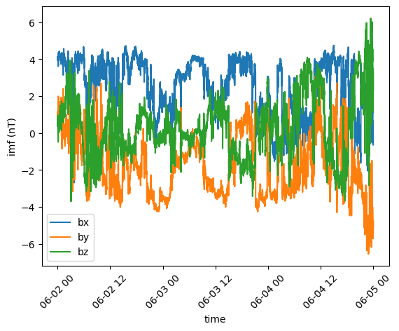

.. raw:: html

    <h1 align="center">
    
    </h1> 

Space Physics made EASY
=======================

.. toctree::
   :titlesonly:
   :hidden:
   :maxdepth: 2

   installation
   user/concepts
   user/data_providers
   examples/index
   user/plotting
   user/numpy
   user/scipy
   user/configuration
   dev/index
   history
   contributing
   authors

.. image:: https://img.shields.io/matrix/speasy:matrix.org
        :target: https://matrix.to/#/#speasy:matrix.org
        :alt: Chat on Matrix

.. image:: https://img.shields.io/pypi/v/speasy.svg
        :target: https://pypi.python.org/pypi/speasy

.. image:: https://github.com/SciQLop/speasy/workflows/Tests/badge.svg
        :target: https://github.com/SciQLop/speasy/actions?query=workflow%3A%22Tests%22

.. image:: https://readthedocs.org/projects/speasy/badge/?version=latest
        :target: https://speasy.readthedocs.io/en/latest/?badge=latest
        :alt: Documentation Status

.. image:: https://codecov.io/gh/SciQLop/speasy/coverage.svg?branch=main
        :target: https://codecov.io/gh/SciQLop/speasy/branch/main
        :alt: Coverage Status

.. image:: https://github.com/SciQLop/speasy/actions/workflows/codeql.yml/badge.svg
        :target: https://github.com/SciQLop/speasy/actions/workflows/codeql.yml
        :alt: CodeQL

.. image:: https://zenodo.org/badge/DOI/10.5281/zenodo.4118780.svg
   :target: https://doi.org/10.5281/zenodo.4118780
   :alt: Zenodo DOI

.. image:: https://mybinder.org/badge_logo.svg
    :target: https://mybinder.org/v2/gh/SciQLop/speasy/main?labpath=docs/examples
    :alt: Discover on MyBinder

.. image:: https://colab.research.google.com/assets/colab-badge.svg
    :target: https://colab.research.google.com/github/SciQLop/speasy
    :alt: Open in Colab

Speasy is a free and open-source Python package that makes it easy to find and load space physics data from a variety of
data sources, whether online and public such as `CDAWEB <https://cdaweb.gsfc.nasa.gov/index.html/>`__ and `AMDA <http://amda.irap.omp.eu/>`__,
or any local or remote archive — see :doc:`data providers <user/data_providers>` for the full list of supported services.
Finding and loading data is where any science project starts. It would seem easy a priori but, considering the
diverse array of missions and instruments available nowadays, it proves to be one of the major bottlenecks,
especially for students and newcomers.
Speasy solves this problem by providing a **single, easy-to-use interface to over 70 space missions and 65,000 products**.

Quickstart
----------

Installing Speasy with pip (:doc:`more details here <installation>`):

.. code-block:: console

    $ python -m pip install speasy
    # or
    $ python -m pip install --user speasy

Getting data is as simple as:

.. [[[cog
   # Everything between a cog marker comment and its matching end marker below is generated by
   # `make docs-quickstart` (cogapp, https://cog.readthedocs.io): it executes the Python shown in
   # each visible code-block for real (live network calls to AMDA/SSC) and writes the block plus,
   # where relevant, a real generated plot back in place. Never hand-edit a generated region; edit
   # the run("""...""") source strings below instead and regenerate. `make docs-quickstart-check`
   # verifies in CI that this file matches what regenerating it would produce.
   import os
   import cog
   import matplotlib
   matplotlib.use("Agg")
   import matplotlib.pyplot as plt

   def run(code):
       cog.outl(".. code-block:: python")
       cog.outl("")
       for line in code.strip().splitlines():
           cog.outl(f"    {line}")
       exec(compile(code, "<index.rst>", "exec"), globals())

   def show_image(name, alt, width="49%"):
       plt.savefig(os.path.join("_static", name), bbox_inches="tight")
       plt.close("all")
       cog.outl("")
       cog.outl(f".. image:: _static/{name}")
       cog.outl(f"   :width: {width}")
       cog.outl(f"   :alt: {alt}")

   run("""
   import speasy as spz
   ace_mag = spz.get_data('amda/imf', "2016-6-2", "2016-6-5")
   ace_mag.plot()
   """)
   show_image("quickstart_ace_mag.png", "ACE IMF data")
   ]]]
.. code-block:: python

    import speasy as spz
    ace_mag = spz.get_data('amda/imf', "2016-6-2", "2016-6-5")
    ace_mag.plot()

.. [[[end]]]

Where ``amda`` is the data provider and ``imf`` is the product ID.

Using the dynamic inventory, this can be even more discoverable:

.. [[[cog
   run("""
   import speasy as spz
   amda_tree = spz.inventories.data_tree.amda
   ace_mag = spz.get_data(amda_tree.Parameters.ACE.MFI.ace_imf_all.imf, "2016-6-2", "2016-6-5")
   """)
   ]]]
.. code-block:: python

    import speasy as spz
    amda_tree = spz.inventories.data_tree.amda
    ace_mag = spz.get_data(amda_tree.Parameters.ACE.MFI.ace_imf_all.imf, "2016-6-2", "2016-6-5")
.. [[[end]]]

This produces the same result as the previous example but lets you discover available data
through tab-completion in IPython, Jupyter notebooks, or any Python environment that supports it.

This also works with `SSCWEB <https://sscweb.gsfc.nasa.gov/>`__, you can easily download trajectories:

.. [[[cog
   run("""
   import speasy as spz
   sscweb_tree = spz.inventories.data_tree.ssc
   solo = spz.get_data(sscweb_tree.Trajectories.solarorbiter, "2021-01-01", "2021-02-01")
   """)
   ]]]
.. code-block:: python

    import speasy as spz
    sscweb_tree = spz.inventories.data_tree.ssc
    solo = spz.get_data(sscweb_tree.Trajectories.solarorbiter, "2021-01-01", "2021-02-01")
.. [[[end]]]

More complex requests like this one are supported:

.. [[[cog
   run("""
   import speasy as spz
   products = [
       spz.inventories.tree.amda.Parameters.Wind.SWE.wnd_swe_kp.wnd_swe_vth,
       spz.inventories.tree.amda.Parameters.Wind.SWE.wnd_swe_kp.wnd_swe_pdyn,
       spz.inventories.tree.amda.Parameters.Wind.SWE.wnd_swe_kp.wnd_swe_n,
       spz.inventories.tree.cda.Wind.WIND.MFI.WI_H2_MFI.BGSE,
       spz.inventories.tree.ssc.Trajectories.wind,
   ]
   intervals = [["2010-01-02", "2010-01-02T10"], ["2009-08-02", "2009-08-02T10"]]
   data = spz.get_data(products, intervals)
   """)
   ]]]
.. code-block:: python

    import speasy as spz
    products = [
        spz.inventories.tree.amda.Parameters.Wind.SWE.wnd_swe_kp.wnd_swe_vth,
        spz.inventories.tree.amda.Parameters.Wind.SWE.wnd_swe_kp.wnd_swe_pdyn,
        spz.inventories.tree.amda.Parameters.Wind.SWE.wnd_swe_kp.wnd_swe_n,
        spz.inventories.tree.cda.Wind.WIND.MFI.WI_H2_MFI.BGSE,
        spz.inventories.tree.ssc.Trajectories.wind,
    ]
    intervals = [["2010-01-02", "2010-01-02T10"], ["2009-08-02", "2009-08-02T10"]]
    data = spz.get_data(products, intervals)
.. [[[end]]]

Features
--------
- Simple and intuitive API (spz.get_data to get them all)
- Pandas DataFrame like interface for variables (columns, values, index)
- Quick functions to convert a variable to a Pandas DataFrame
- Dynamic inventory to discover available data from your favourite Python environment completion
- Speasy variables support :doc:`NumPy operations <user/numpy>`
- Speasy variables support :doc:`filtering, resampling, and interpolation <user/scipy>`
- Quick :doc:`line and spectrogram plotting <user/plotting>`
- Local cache to avoid redundant downloads
- Can take advantage of SciQLop dedicated proxy as a community backed ultra fast cache
- Full support of `AMDA <http://amda.irap.omp.eu/>`__ API
- Can retrieve time-series from `AMDA <http://amda.irap.omp.eu/>`__ (CDPP parameters, catalogs, and timetables),
  `CDAWeb <https://cdaweb.gsfc.nasa.gov/>`__ (NASA's public heliophysics archive), `CSA <https://csa.esac.esa.int/csa-web/>`__
  (Cluster and Double Star mission data), and `SSCWeb <https://sscweb.gsfc.nasa.gov/>`__ (spacecraft trajectories) —
  see :doc:`data providers <user/data_providers>` for what each provider offers
- Can retrieve data from any local or remote archive with a :doc:`simple configuration file <user/direct_archive/direct_archive>`
- Also available as `Speasy.jl <https://github.com/SciQLop/Speasy.jl>`__ for Julia users

Examples
========
See :doc:`here <examples/index>` for a complete list of examples.

Next steps
----------

- New to Speasy? Start with :doc:`user/concepts` to understand products, providers, and inventories.
- Browse the :doc:`example gallery <examples/index>` for ready-to-run notebooks.
- Tune caching, proxies, and provider settings in :doc:`user/configuration`.

:doc:`Go to developers doc <dev/index>`
