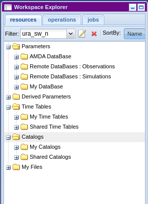
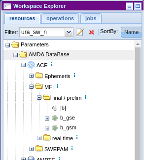
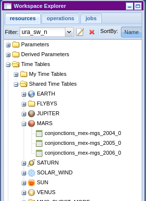
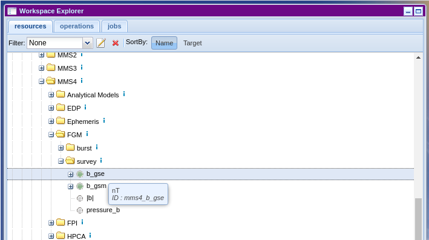
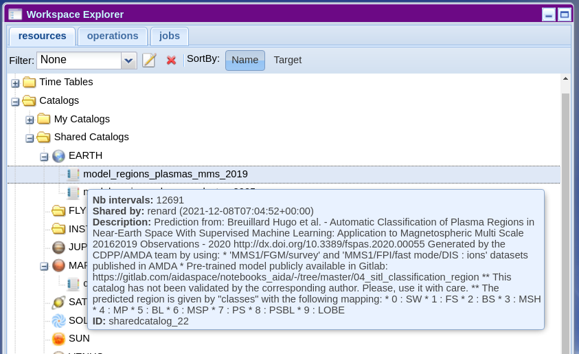
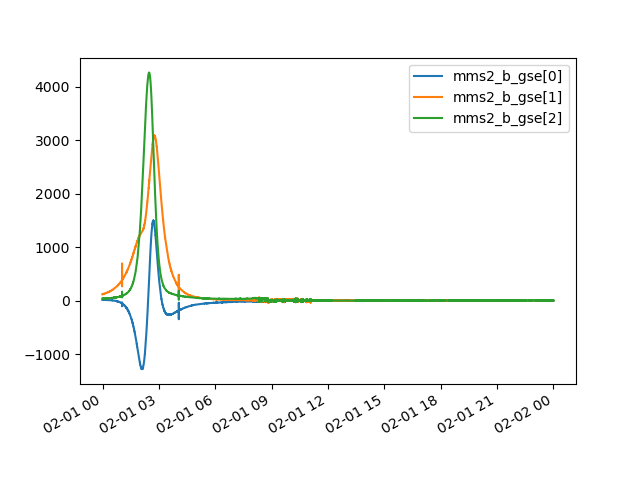
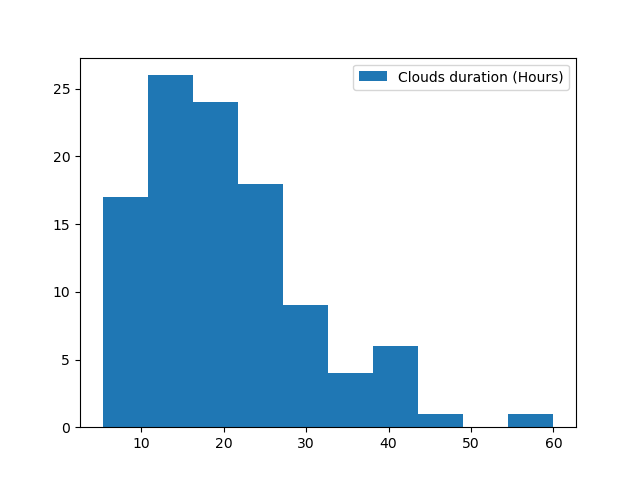
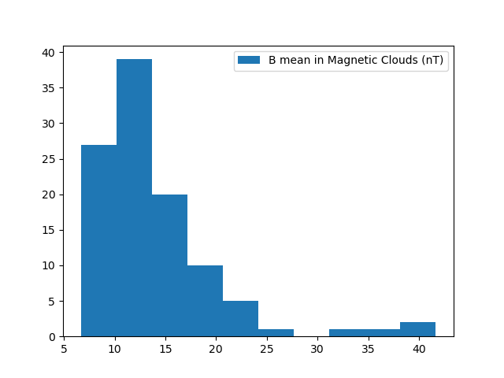

Automated Multi-Dataset Analysis (AMDA)
=======================================

.. toctree::
   :maxdepth: 1

`AMDA <http://amda.irap.omp.eu/>`__ is one of the main data providers handled by speasy. All products are either available using directly the AMDA module or using :meth:`speasy.get_data()`.
:meth:`speasy.get_data()` usage should be preferred over AMDA module methods since it is more flexible and it's interface is guaranteed to be more stable.
The following documentation will focus on AMDA module specific usage.

Basics: Getting data from AMDA
------------------------------

`AMDA <http://amda.irap.omp.eu/>`_ distributes several public or private products such as Parameters, Datasets, Timetables and Catalogs.
Speasy makes them accessible thanks to this module with :meth:`~speasy.data_providers.amda.ws.AMDA_Webservice.get_data()`
or their dedicated methods such as :meth:`~speasy.data_providers.amda.ws.AMDA_Webservice.get_parameter()`, :meth:`~speasy.data_providers.amda.ws.AMDA_Webservice.get_user_parameter()`,...
Note that you can browse the list of all available products from `AMDA <http://amda.irap.omp.eu/>`__ Workspace:

This module provides two kinds of operations, **list** or **get** and so user methods are prefixed with one of them.

    - **get** methods retrieve the given product from AMDA server, they takes at least the product identifier and time range for time series
    - **list** methods list available products of a given type on AMDA, they return a list of indexes that can be passed to a **get** method

Parameters
^^^^^^^^^^

Let's start with a simple example, we want to download the first parameter available on AMDA:

    >>> from speasy import amda
    >>> first_param_index=amda.list_parameters()[0]
    >>> print(first_param_index)
    <ParameterIndex: He flux>
    >>> first_param=amda.get_parameter(first_param_index, "2018-01-01", "2018-01-02T01")
    >>> first_param.columns
    ['He flux[0]', 'He flux[1]']
    >>> len(first_param.time)
    288

Usually you already know which product you want to download, two scenarios are available:

1. You are an `AMDA <http://amda.irap.omp.eu/>`_ web interface user, so you want some specific product from AMDA Workspace. You need first to get your product id,
you will find the id from the tooltip while hovering any product (Dataset, Parameter, Timetable or Catalog):

Then simply:

    >>> from speasy import amda
    >>> mms4_fgm_btot=amda.get_parameter('mms4_b_tot', "2018-01-01", "2018-01-01T01")
    >>> mms4_fgm_btot.columns
    ['|b|']
    >>> len(mms4_fgm_btot.time)
    57600

2. Second scenario, your are not much familiar with AMDA, then you can simply browse speasy dynamic inventory. In
the following example, we alias AMDA data tree as amdatree, note that Python completion works and you will be able to discover
AMDA products directly from your Python terminal or notebook:

    >>> import speasy as spz
    >>> from speasy import amda
    >>> amdatree = spz.inventories.tree.amda
    >>> mms4_fgm_btot=amda.get_parameter(amdatree.Parameters.MMS.MMS4.FGM.mms4_fgm_srvy.mms4_b_tot, "2018-01-01", "2018-01-01T01")
    >>> mms4_fgm_btot.columns
    ['|b|']
    >>> len(mms4_fgm_btot.time)
    57600

See :meth:`~speasy.data_providers.amda.ws.AMDA_Webservice.get_parameter()` or :meth:`~speasy.data_providers.amda.ws.AMDA_Webservice.get_data()` for more details.

Catalogs and TimeTables
^^^^^^^^^^^^^^^^^^^^^^^

Downloading Catalogs and TimeTables from `AMDA <http://amda.irap.omp.eu/>`_ is similar to Parameters. For example let's
assume you want to download the first available catalog:

    >>> from speasy import amda
    >>> first_catalog_index=amda.list_catalogs()[0]
    >>> print(first_catalog_index)
    <CatalogIndex: model_regions_plasmas_mms_2019>
    >>> first_catalog=amda.get_catalog(first_catalog_index)
    >>> first_catalog
    <Catalog: model_regions_plasmas_mms_2019>
    >>> len(first_catalog)
    12691
    >>> print(first_catalog[1])
    <Event: 2019-01-01T00:24:04+00:00 -> 2019-01-01T00:24:04+00:00 | {'classes': '1'}>

Exactly the same with a TimeTable:

    >>> from speasy import amda
    >>> first_timetable_index=amda.list_timetables()[0]
    >>> print(first_timetable_index)
    <TimetableIndex: FTE_c1>
    >>> first_timetable=amda.get_timetable(first_timetable_index)
    >>> first_timetable
    <TimeTable: FTE_c1>
    >>> len(first_timetable)
    782
    >>> print(first_timetable[1])
    <DateTimeRange: 2001-02-02T17:29:29+00:00 -> 2001-02-02T17:29:30+00:00>

As with Parameters you can also use the ID found on `AMDA <http://amda.irap.omp.eu/>`_ web user interface:

Then simply:

    >>> from speasy import amda
    >>> catalog_mms_2019=amda.get_catalog("sharedcatalog_22")
    >>> catalog_mms_2019
    <Catalog: model_regions_plasmas_mms_2019>
    >>> len(catalog_mms_2019)
    12691
    >>> print(catalog_mms_2019[1])
    <Event: 2019-01-01T00:24:04+00:00 -> 2019-01-01T00:24:04+00:00 | {'classes': '1'}>

And also alternatively you can use the dynamic inventory:

    >>> from speasy import amda
    >>> import speasy as spz
    >>> amdatree = spz.inventories.tree.amda
    >>> catalog_mms_2019=amda.get_catalog(amdatree.Catalogs.SharedCatalogs.EARTH.model_regions_plasmas_mms_2019)
    >>> catalog_mms_2019
    <Catalog: model_regions_plasmas_mms_2019>
    >>> len(catalog_mms_2019)
    12691
    >>> print(catalog_mms_2019[1])
    <Event: 2019-01-01T00:24:04+00:00 -> 2019-01-01T00:24:04+00:00 | {'classes': '1'}>

Some examples using AMDA products
---------------------------------

My first plot from AMDA
^^^^^^^^^^^^^^^^^^^^^^^

In this example we will use AMDA module to retrieve and plot MMS2 FGM data, feel free to change the code and experiment!

    >>> import matplotlib.pyplot as plt # doctest: +SKIP
    >>> import speasy as spz
    >>> amdatree = spz.inventories.tree.amda
    >>> mms2_b_gse = spz.amda.get_parameter(amdatree.Parameters.MMS.MMS2.FGM.mms2_fgm_srvy.mms2_b_gse, "2019-01-01", "2019-01-02")
    >>> # Check that mms2_b_gse isn't empty
    >>> len(mms2_b_gse)
    816750
    >>> # Then you can use the SpeasyVariable plot method for quick plots
    >>> mms2_b_gse.plot() # doctest: +SKIP
    >>> plt.show() # doctest: +SKIP

Then you should get something like this:

.. note::
    * Depending on your matplotlib backend and if you are using Jupyter Notebooks or a simple python terminal you may need to adapt this example.
    * Speasy is not a plotting package, to produce publication ready figures, use something like matplotlib or seaborn directly.

Using timetables to download data
^^^^^^^^^^^^^^^^^^^^^^^^^^^^^^^^^

In this example we will use AMDA to first retrieve a public timetable containing time intervals where Magnetic Clouds
were detected with `Wind <https://wind.nasa.gov/>`_ spacecraft. Then download the magnetic field magnitude measured with
`MFI <https://wind.nasa.gov/mfi/instrumentation.html>`_ instrument for each interval where a Magnetic cloud was found.
Once we have magnetic field measurements inside each cloud, we will as an example plot the average distribution.

    >>> import matplotlib.pyplot as plt # doctest: +SKIP
    >>> import numpy as np
    >>> import speasy as spz
    >>> amda_timetables = spz.inventories.tree.amda.TimeTables
    >>> amda_parameters = spz.inventories.tree.amda.Parameters
    >>> Magnetic_Clouds = spz.amda.get_timetable(amda_timetables.SharedTimeTables.SOLAR_WIND.Magnetic_Clouds)
    >>> print(Magnetic_Clouds.meta['description'])  # doctest: +NORMALIZE_WHITESPACE
    Magnetic Clouds from WIND/MFI 1995-2007 -- Estimated start and end times from a magnetic field model [Lepping et al., 1990] which assumes that the field within the magnetic cloud is force free, i.e., so that the electrical current and the magnetic field are parallel and proportional in strength everywhere within its volume -- see http://lepmfi.gsfc.nasa.gov/mfi/mag_cloud_pub1.html ;
            Historic: From old AMDA;
            Creation Date :  2013-11-22T13:52:50;
    >>> # Check that the timetable has at least some events (as expected)
    >>> len(Magnetic_Clouds)
    106
    >>> # Then we can plot their duration distribution
    >>> def duration(event):
    ...     return (event.stop_time.timestamp() - event.start_time.timestamp())/3600
    ...
    >>> clouds_duration = [duration(cloud) for cloud in Magnetic_Clouds]
    >>> plt.hist(clouds_duration, label="Clouds duration (Hours)") # doctest: +SKIP
    >>> plt.legend() # doctest: +SKIP
    >>> plt.show() # doctest: +SKIP
    >>> # Now let's get MFI data for each cloud
    >>> b_mfi_coulds = spz.get_data(amda_parameters.Wind.MFI.wnd_mfi_kp.wnd_bmag, Magnetic_Clouds)
    >>> # compute mean of B for each cloud and ignore NaNs
    >>> b_mean_mfi_clouds = [ np.nanmean(cloud.values) for cloud in b_mfi_coulds ]
    >>> plt.hist(b_mean_mfi_clouds, label="B mean in Magnetic Clouds (nT)") # doctest: +SKIP
    >>> plt.legend() # doctest: +SKIP
    >>> plt.show() # doctest: +SKIP

Then you should get something like these plots:

.. note::
    * Depending on your matplotlib backend and if you are using Jupyter Notebooks or a simple python terminal you may need to adapt this example.
    * Speasy is not a plotting package, to produce publication ready figures, use something like matplotlib or seaborn directly.

Advanced: AMDA module configuration options
-------------------------------------------

AMDA user login
^^^^^^^^^^^^^^^

Most AMDA features are available without login except user created product from web user interface. You can configure
speasy to store your AMDA login, from your favourite python terminal:

    >>> from speasy import config
    >>> config.amda.username.set('my_username') # doctest: +SKIP
    >>> config.amda.password.set('my_password') # doctest: +SKIP
    >>> # check that your login/password are correctly set
    >>> config.amda.username.get(), config.amda.password.get() # doctest: +SKIP
    ('my_username', 'my_password')

Then if you correctly typed your login you should be able to list and get user products:

    >>> from speasy import amda
    >>> # list user products
    >>> amda.list_user_parameters() # doctest: +SKIP
    [<ParameterIndex: test_param>]
    >>> amda.list_user_catalogs() # doctest: +SKIP
    [<CatalogIndex: MyCatalog>]
    >>> amda.list_user_timetables() # doctest: +SKIP
    [<TimetableIndex: test_alexis>, <TimetableIndex: test_alexis2>, <TimetableIndex: tt3>]
    >>> # get my first user catalog
    >>> amda.get_user_catalog(amda.list_user_catalogs()[0]) # doctest: +SKIP
    <Catalog: MyCatalog>

AMDA cache retention
^^^^^^^^^^^^^^^^^^^^

While parameter download cache is not configurable and relies on product version to decide if local data is up to date
compared to remote data. Requests like catalogs or time-tables download have a different dedicated cache
based on duration, by default they will be cached for 15 minutes. As a consequence if a time-table has changed on AMDA servers
it might take up to the configured duration to see it.
This cache has been designed with interactive usage of speasy in mind where we want to minimize penalty of running
multiple times the same command/line in a short amount of time.

To change this cache duration value:

    >>> from speasy import config
    >>> # set cache duration to 900 seconds
    >>> config.amda.user_cache_retention.set(900)
    >>> config.amda.user_cache_retention.get()
    900
