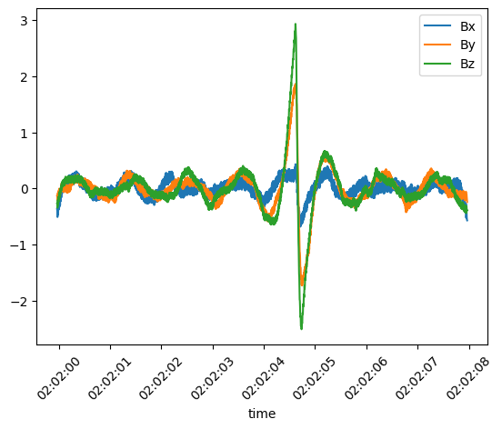

Direct archive access
=====================

.. toctree::
   :maxdepth: 1

The Direct Archive Access module in Speasy enables users to access any local or remote data archive that stores data in
`ISTP <https://spdf.gsfc.nasa.gov/istp_guide/>`_ compliant `CDF <https://cdf.gsfc.nasa.gov/>`_ files. This module does not interact with any web service. Instead, it provides flexibility for users
to configure and populate the necessary configuration files to expose the desired products.

Using this module, Speasy can seamlessly retrieve data from the specified data archive, leveraging predictable file names
and paths within the archive. By adhering to the `ISTP <https://spdf.gsfc.nasa.gov/istp_guide/>`_  standards, Speasy
ensures compatibility and smooth data access.

This module supports both regularly split files (one file per day for example) and randomly split files such as burst data.

To add your favourite products into Speasy, you need to add or edit an yaml file either located in Speasy lookup
path, default user lookup path can be retrieved with ``spz.data_providers.generic_archive.user_inventory_dir()``. You need to
add an entry per dataset with the following information:

- For a regularly split dataset, you can configure it using the following YAML structure:

.. code-block:: YAML

    tha_efi:
      inventory_path: cdpp/THEMIS/THA/L2
      master_cdf: http://cdpp.irap.omp.eu/themisdata/tha/l2/efi/0000/tha_l2_efi_00000000_v01.cdf
      split_frequency: daily
      split_rule: regular
      url_pattern: http://cdpp.irap.omp.eu/themisdata/tha/l2/efi/{Y}/tha_l2_efi_{Y}{M:02d}{D:02d}_v\d+.cdf
      use_file_list: true

Here's an explanation of the parameters::
    - **tha_efi**: The name you want to assign to your dataset.
    - **inventory_path:**: The desired inventory path for your dataset. In this example, it can be found in ``spz.inventories.data_tree.archive.cdpp.THEMIS.THA.L2.tha_efi``.
    - **master_cdf:**: The URL or path to download a master CDF or any sample CDF for this dataset. Speasy requires it to complete the inventory with the dataset's `data variables <https://spdf.gsfc.nasa.gov/istp_guide/variables.html#Data>`_. It is recommended to use master CDFs as they contain sufficient information while being smaller in size.
    - **split_frequency:**: The frequency at which your dataset is split. For example, if you have one file per day, month, or year. Allowed values are *daily*, *monthly*, *yearly*.
    - **url_pattern:**: The URL pattern to access each file. When requesting data within a specific interval, Speasy utilizes the *split_frequency* to determine the number of files to download and replaces the date/time information accordingly. It uses python *{}* format syntax, and available date/time placeholders are year (**Y**), month (**M**) and day (**D**) are available. You can also utilize Python regular expressions if you are unable to predict certain parts of the file name, such as the file version, but you have set *use_file_list* to true.
    - **use_file_list:**: If set to true, Speasy lists the files in the specified directory after generating the URL based on the *url_pattern*. It then selects the last matching file.

- For a randomly split dataset, you can configure it using the following YAML structure:

.. code-block:: YAML

    mms2_fpi_brst_l2_des_moms:
        url_pattern: 'https://cdaweb.gsfc.nasa.gov/pub/data/mms/mms2/fpi/brst/l2/des-moms/{Y}/{M:02d}/mms2_fpi_brst_l2_des-moms_{Y}{M:02d}\d+_v\d+.\d+.\d+.cdf'
        use_file_list: true
        master_cdf: "https://cdaweb.gsfc.nasa.gov/pub/software/cdawlib/0MASTERS/mms2_fpi_brst_l2_des-moms_00000000_v01.cdf"
        inventory_path: 'cda/MMS/MMS2/FPI/BURST/MOMS'
        split_rule: "random"
        split_frequency: "monthly"
        fname_regex: 'mms2_fpi_brst_l2_des-moms_(?P<start>\d+)_v(?P<version>[\d\.]+)\.cdf'

Here's an explanation of the parameters::
    - **mms2_fpi_brst_l2_des_moms**: The name you want to assign to your dataset.
    - **inventory_path:**: The desired inventory path for your dataset. In this example, it can be found in ``spz.inventories.data_tree.archive.cda.MMS.MMS2.FPI.BURST.MOMS.mms2_fpi_brst_l2_des_moms``.
    - **master_cdf:**: The URL or path to download a master CDF or any sample CDF for this dataset. Speasy requires it to complete the inventory with the dataset's `data variables <https://spdf.gsfc.nasa.gov/istp_guide/variables.html#Data>`_. It is recommended to use master CDFs as they contain sufficient information while being smaller in size.
    - **split_frequency:**: The frequency at which folders are is split for this dataset. For example, if you have one folder per day, month, or year. Allowed values are *daily*, *monthly*, *yearly*.
    - **url_pattern:**: The URL pattern to access files covering the current time range. When requesting data within a specific interval, Speasy utilizes the *split_frequency* to determine the number of folders to scan and replaces the date/time information accordingly. It uses python *{}* format syntax, and available date/time placeholders are year (**Y**), month (**M**) and day (**D**) are available. With randomly split datasets, it is important to ensure that the URL pattern includes the fixed and deterministic parts and rely on the **fname_regex** field to match files that cover the requested time range.
    - **use_file_list:**: If set to true, Speasy lists the files in the specified directory after generating the URL based on the *url_pattern*. It then selects the last matching file.
    - **fname_regex**: This regular expression is used to extract information such as the start date, stop date, and file version from the file names. It follows Python's regular expression syntax and captures specific groups. The expected or supported groups are:
        - `start`: Start date, it should be parsable by ``dateutil.parser.parse`` (mandatory)
        - `stop`: Stop date, same as start date (optional)
        - `version`: Dataset version (optional)

Custom file format support (advanced users)
-------------------------------------------

If your data archive does not follow the ISTP standards enough to be supported by Speasy or it uses an unsupported file format, you can still take advantage of the Direct Archive Access module to easily access your data.

To do so, you need to create a custom reader function that loads the requested variable from the given file URL and returns it as a ``speasy.products.variable.SpeasyVariable`` or None if the variable is not found in the file.

The function should have the following signature:

.. code-block:: python

    def custom_reader(url: str, variable_name: str, **kwargs) -> SpeasyVariable or None:
        pass

Then you can use the ``speasy.core.direct_archive_downloader.get_product`` method directly to download the data on any time interval using your custom reader function.

Here is an example of a custom reader function that reads SolarOrbiter LFR snapshot data that are not ISTP compliant:

.. code-block:: python

    import speasy as spz
    from speasy.products import SpeasyVariable, VariableTimeAxis, DataContainer
    from speasy.core.direct_archive_downloader import get_product
    from speasy.core.any_files import any_loc_open
    import numpy as np
    import pycdfpp
    import matplotlib.pyplot as plt

    def snapshots_B_custom_reader(url, variable='B', sampling = 24576.):
        cdf=pycdfpp.load(any_loc_open(url,cache_remote_files=True).read())
        # all snapshots for different sampling rates are stored in the same variable
        # so we need to build an index of the snapshots with the desired sampling rate
        indexes = cdf["SAMPLING_RATE"].values[:] == sampling
        # build time axis from each snapshot start time and sampling rate
        star_times = pycdfpp.to_datetime64(cdf["Epoch"].values[indexes]).astype(np.int64)
        time = np.linspace(star_times, star_times+2048*int(1e9/sampling),num=2048).astype('datetime64[ns]').T.reshape(-1)
        sel_values = cdf[variable].values[indexes]
        values = np.empty((sel_values.shape[0]*sel_values.shape[2],3), sel_values.dtype)
        values[:,0] = sel_values[:,0,:].reshape(-1)
        values[:,1] = sel_values[:,1,:].reshape(-1)
        values[:,2] = sel_values[:,2,:].reshape(-1)
        if 'RTN' in variable:
            labels = ['Bxrtn', 'Byrtn', 'Bzrtn']
        else:
            labels = ['Bx', 'By', 'Bz']
        return SpeasyVariable(axes=[VariableTimeAxis(values= time)],values=DataContainer(values), columns=labels)

    lfr_b_F2 = get_product(url_pattern="http://sciqlop.lpp.polytechnique.fr/cdaweb-data/pub/data/solar-orbiter/rpw/science/l2/lfr-surv-swf-b/{Y}/solo_l2_rpw-lfr-surv-swf-b_{Y}{M:02}{D:02}_v\d+.cdf",
                        start_time="2023-06-19T02:01:59",
                        stop_time="2023-06-19T02:02:08",
                        variable="B",
                        split_rule="regular",
                        split_frequency="daily",
                        use_file_list=True,
                        file_reader=snapshots_B_custom_reader,
                        sampling = 256.
                        )
    plt.figure()
    lfr_b_F2.plot()
    plt.show()

This should produce the following plot:

