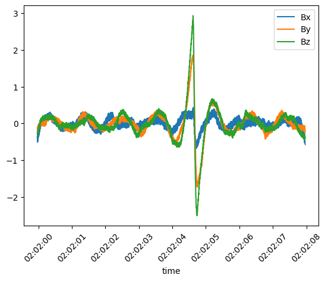

Direct archive access
=====================

.. toctree::
   :maxdepth: 1

The Direct Archive Access module in Speasy enables users to access any local or remote data archive that stores data in
`ISTP <https://spdf.gsfc.nasa.gov/istp_guide/>`_ compliant `CDF <https://cdf.gsfc.nasa.gov/>`_ files. This module does not interact with any web service. Instead, it provides flexibility for users
to configure and populate the necessary configuration files to expose the desired products.

Using this module, Speasy can seamlessly retrieve data from the specified data archive, leveraging predictable file names
and paths within the archive. By adhering to the `ISTP <https://spdf.gsfc.nasa.gov/istp_guide/>`_  standards, Speasy
ensures compatibility and smooth data access.

This module supports both regularly split files (one file per day for example) and randomly split files such as burst data.

To add your own products to Speasy, create or edit a YAML file in Speasy's user inventory directory.
You can find this directory with ``spz.data_providers.generic_archive.user_inventory_dir()``.
Each dataset requires one entry in the YAML file with the following information:

- For a regularly split dataset, you can configure it using the following YAML structure:

.. code-block:: YAML

    tha_efi:
      inventory_path: cdpp/THEMIS/THA/L2
      master_cdf: http://cdpp.irap.omp.eu/themisdata/tha/l2/efi/0000/tha_l2_efi_00000000_v01.cdf
      split_frequency: daily
      split_rule: regular
      url_pattern: http://cdpp.irap.omp.eu/themisdata/tha/l2/efi/{Y}/tha_l2_efi_{Y}{M:02d}{D:02d}_v\d+.cdf
      use_file_list: true

Parameters:

- **tha_efi** — the name you want to assign to your dataset.
- **inventory_path** — the desired inventory path. In this example, the product will appear at ``spz.inventories.data_tree.archive.cdpp.THEMIS.THA.L2.tha_efi``.
- **master_cdf** — URL or path to a master CDF (or any sample CDF). Speasy needs it to discover the dataset's `data variables <https://spdf.gsfc.nasa.gov/istp_guide/variables.html#Data>`_. Master CDFs are preferred because they are smaller.
- **split_frequency** — how often files are split: ``daily``, ``monthly``, or ``yearly``.
- **url_pattern** — URL pattern to access each file. Uses Python ``{}`` format syntax with placeholders: **Y** (year), **M** (month), **D** (day). You can include Python regular expressions for unpredictable parts (e.g. file version) when *use_file_list* is ``true``.
- **use_file_list** — if ``true``, Speasy lists files in the directory matching the *url_pattern* and selects the last match. Required when the URL contains regex patterns.

- For a randomly split dataset, you can configure it using the following YAML structure:

.. code-block:: YAML

    mms2_fpi_brst_l2_des_moms:
        url_pattern: 'https://cdaweb.gsfc.nasa.gov/pub/data/mms/mms2/fpi/brst/l2/des-moms/{Y}/{M:02d}/mms2_fpi_brst_l2_des-moms_{Y}{M:02d}\d+_v\d+.\d+.\d+.cdf'
        use_file_list: true
        master_cdf: "https://cdaweb.gsfc.nasa.gov/pub/software/cdawlib/0MASTERS/mms2_fpi_brst_l2_des-moms_00000000_v01.cdf"
        inventory_path: 'cda/MMS/MMS2/FPI/BURST/MOMS'
        split_rule: "random"
        split_frequency: "monthly"
        fname_regex: 'mms2_fpi_brst_l2_des-moms_(?P<start>\d+)_v(?P<version>[\d\.]+)\.cdf'

The parameters are the same as for regularly split datasets, with these differences:

- **split_frequency** — for randomly split datasets, this controls the folder granularity (how often folders change), not file granularity.
- **url_pattern** — should cover the fixed, deterministic parts of the URL. The ``fname_regex`` field handles matching individual files within each folder.
- **fname_regex** — a Python regular expression to extract metadata from file names. Supported named groups:

  - ``start`` — start date, must be parsable by ``dateutil.parser.parse`` (mandatory)
  - ``stop`` — stop date (optional)
  - ``version`` — dataset version (optional)

Custom file format support (advanced users)
-------------------------------------------

If your data archive does not follow the ISTP standards enough to be supported by Speasy or it uses an unsupported file format, you can still take advantage of the Direct Archive Access module to easily access your data.

To do so, you need to create a custom reader function that loads the requested variable from the given file URL and returns it as a ``speasy.products.variable.SpeasyVariable`` or None if the variable is not found in the file.

The function should have the following signature:

.. code-block:: python

    def custom_reader(url: str, variable_name: str, **kwargs) -> SpeasyVariable or None:
        pass

Then you can use the ``speasy.core.direct_archive_downloader.get_product`` method directly to download the data on any time interval using your custom reader function.

Here is an example of a custom reader function that reads SolarOrbiter LFR snapshot data that are not ISTP compliant:

.. code-block:: python

    import speasy as spz
    from speasy.products import SpeasyVariable, VariableTimeAxis, DataContainer
    from speasy.core.direct_archive_downloader import get_product
    from speasy.core.any_files import any_loc_open
    import numpy as np
    import pycdfpp
    import matplotlib.pyplot as plt

    def snapshots_B_custom_reader(url, variable='B', sampling = 24576.):
        cdf=pycdfpp.load(any_loc_open(url,cache_remote_files=True).read())
        # all snapshots for different sampling rates are stored in the same variable
        # so we need to build an index of the snapshots with the desired sampling rate
        indexes = cdf["SAMPLING_RATE"].values[:] == sampling
        # build time axis from each snapshot start time and sampling rate
        star_times = pycdfpp.to_datetime64(cdf["Epoch"].values[indexes]).astype(np.int64)
        time = np.linspace(star_times, star_times+2048*int(1e9/sampling),num=2048).astype('datetime64[ns]').T.reshape(-1)
        sel_values = cdf[variable].values[indexes]
        values = np.empty((sel_values.shape[0]*sel_values.shape[2],3), sel_values.dtype)
        values[:,0] = sel_values[:,0,:].reshape(-1)
        values[:,1] = sel_values[:,1,:].reshape(-1)
        values[:,2] = sel_values[:,2,:].reshape(-1)
        if 'RTN' in variable:
            labels = ['Bxrtn', 'Byrtn', 'Bzrtn']
        else:
            labels = ['Bx', 'By', 'Bz']
        return SpeasyVariable(axes=[VariableTimeAxis(values= time)],values=DataContainer(values), columns=labels)

    lfr_b_F2 = get_product(url_pattern="http://sciqlop.lpp.polytechnique.fr/cdaweb-data/pub/data/solar-orbiter/rpw/science/l2/lfr-surv-swf-b/{Y}/solo_l2_rpw-lfr-surv-swf-b_{Y}{M:02}{D:02}_v\d+.cdf",
                        start_time="2023-06-19T02:01:59",
                        stop_time="2023-06-19T02:02:08",
                        variable="B",
                        split_rule="regular",
                        split_frequency="daily",
                        use_file_list=True,
                        file_reader=snapshots_B_custom_reader,
                        sampling = 256.
                        )
    plt.figure()
    lfr_b_F2.plot()
    plt.show()

This should produce the following plot:

