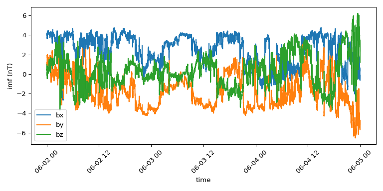
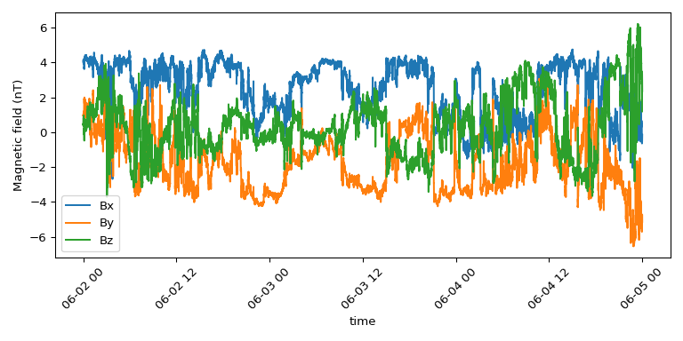
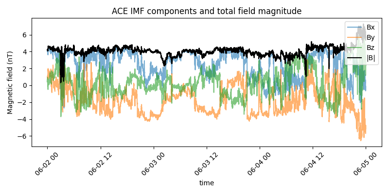
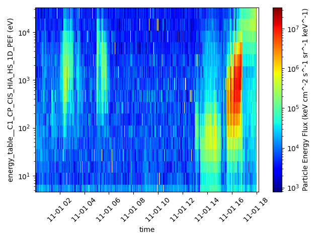

Plotting
========

.. toctree::
   :maxdepth: 1

This page assumes you already have a ``SpeasyVariable`` from :func:`speasy.get_data`; see
:doc:`concepts` first if you don't have one yet.

Every :class:`~speasy.products.variable.SpeasyVariable` has a ``.plot`` property that draws it with
matplotlib, labelling the axes from the variable's own metadata.

.. note::
    Speasy is not a plotting package. For publication-ready figures, use matplotlib (or another plotting
    library) directly on ``variable.time`` and ``variable.values``.

Basic usage
-----------

Calling ``variable.plot()`` picks the plot type from the variable's metadata: a line plot for regular
time series, or a colormap if the variable's ``DISPLAY_TYPE`` says ``"spectrogram"``, as CDAWeb, AMDA and
CSA spectral products typically do.

.. code-block:: python

    import speasy as spz
    import matplotlib.pyplot as plt

    b = spz.get_data("amda/imf", "2016-6-2", "2016-6-5")
    b.plot()
    plt.show()

Customizing the plot
---------------------

``.plot()`` accepts ``ax``, ``labels``, ``units``, ``xaxis_label`` and ``yaxis_label``, falling back to
the variable's own metadata whenever one isn't given. Pass ``ax`` to draw into an existing figure, and
any other keyword (``linewidth``, ``linestyle``, ``alpha``, ...) is forwarded straight through to
matplotlib's ``Axes.plot``. It also returns the ``Axes`` it drew into, so you can keep customizing with
the full matplotlib API afterward:

.. code-block:: python

    fig, ax = plt.subplots(figsize=(8, 4))
    b.plot(ax=ax, labels=["Bx", "By", "Bz"], units="nT", yaxis_label="Magnetic field",
           linewidth=1.2, alpha=0.8)
    ax.set_title("ACE IMF magnetic field (GSE)")
    ax.grid(alpha=0.3)
    ax.legend(loc="upper right")
    plt.tight_layout()
    plt.show()

Passing the same ``ax`` around is also how you overlay independently fetched products on one plot, for
example to compare the IMF components against the total field magnitude:

.. code-block:: python

    b_mag = spz.get_data("amda/imf_mag", "2016-6-2", "2016-6-5")

    fig, ax = plt.subplots(figsize=(8, 4))
    b.plot(ax=ax, labels=["Bx", "By", "Bz"], units="nT", yaxis_label="Magnetic field", alpha=0.6)
    b_mag.plot(ax=ax, labels=["|B|"], units="nT", yaxis_label="Magnetic field", color="k", linewidth=1.5)
    ax.legend(loc="upper right")
    plt.show()

Spectrograms
------------

Spectrogram products are detected from their metadata, so ``.plot()`` is usually enough. Call
``.plot.colormap()`` to force a colormap, or to reach its options: ``logy`` log-scales the y axis
(frequency or energy) and ``logz`` log-scales the colour scale, both on by default, and ``cmap``,
``vmin`` and ``vmax`` are passed through to matplotlib.

Whether you're plotting a line or a colormap, ``.plot()`` also picks up a few ISTP attributes
automatically when the source metadata provides them: ``SCALETYP`` sets the default log/linear
scale (still overridable with ``logy``/``logz``), ``FILLVAL`` entries are masked to NaN before
plotting (disable with ``mask_fillval=False``), and ``LABLAXIS`` is preferred over the raw CDF
variable name for axis and colorbar labels when you don't pass one explicitly.

.. code-block:: python

    csa = spz.inventories.tree.csa.Cluster.Cluster_1.CIS_HIA1.C1_CP_CIS_HIA_HS_1D_PEF
    flux = spz.get_data(csa.flux__C1_CP_CIS_HIA_HS_1D_PEF, "2006-11-01", "2006-11-02")
    flux.plot(cmap="jet")
    plt.tight_layout()
    plt.show()

The line counterpart, ``.plot.line()``, forces a line plot in the same way.

Choosing a backend
-------------------

Matplotlib is the only bundled backend today, and is used unless you ask for another one. Both
``variable.plot(backend="matplotlib")`` and ``variable.plot["matplotlib"]()`` select it explicitly.
